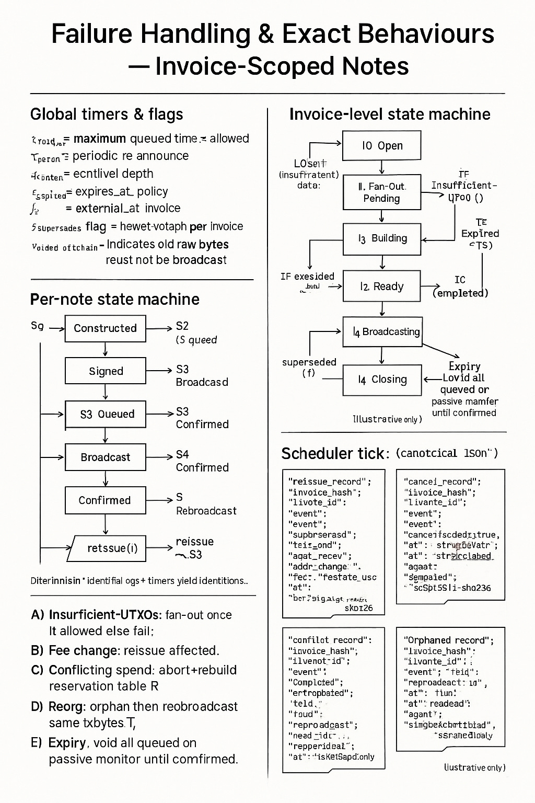

# Peer Cash Wallet Protocol (PCW-1) 🚀

 [](https://deps.rs/repo/github/murphsicles/PCW-1)  

A Rust library implementing the **Peer Cash Wallet Protocol (PCW-1)** for IP-to-IP Bitcoin SV (BSV) settlement, strictly adhering to the specification (§1–§17). This crate provides a robust, secure, and deterministic implementation for key management, address derivation, transaction building, broadcast strategies, receipt generation, and failure handling, designed for auditable and privacy-preserving payments.

## Features ✨

- **Deterministic Derivations**: Per-invoice scoped key and address derivation using ECDH shared secrets (§3, §4, §7).
- **Bounded Note Splitting**: Deterministic splitting with prefix-clamp construction and Fisher-Yates permutation (§5).
- **Disjoint UTXO Selection**: Greedy selection with fan-out support for large payments (§6).
- **P2PKH Transactions**: Secure transaction building and signing using `rust-sv` (§7–§8).
- **Broadcast Strategies**: Configurable pacing (`all_at_once`, `paced`, `bursts`) with either-side authority (§9).
- **Merkle Receipts**: Selective disclosure proofs for auditable payments (§10).
- **State Machines**: Robust failure handling for notes and invoices (§11).
- **Canonical JSON**: Sorted keys, NFC-normalized strings, compact output, and integer-only numbers (§2, §14).
- **Signed Logging**: Append-only logs with chain integrity for auditability (§13).
- **Comprehensive Testing**: Extensive unit and integration tests for all protocol components (§17).

## Installation 📦

Add to your `Cargo.toml`:

```toml
[dependencies]
pcw_protocol = "0.1.0"
```

Ensure you have `rust-sv` for transaction-related functionality:

```toml
[dependencies]
sv = { git = "https://github.com/murphsicles/rust-sv", tag = "v0.5.1" }
```

## Usage Example 💻

```rust
use pcw_protocol::*;
use sv::messages::OutPoint;
use sv::transaction::p2pkh::create_lock_script;
use sv::util::{Hash160, Hash256};
use chrono::Utc;

fn main() -> Result<(), PcwError> {
    // Create mock keys
    let priv_a = [1u8; 32];
    let identity_a = IdentityKeypair::new(priv_a)?;
    let priv_b = [2u8; 32];
    let identity_b = IdentityKeypair::new(priv_b)?;
    let anchor_a = AnchorKeypair::new([3u8; 32])?;
    let anchor_b = AnchorKeypair::new([4u8; 32])?;

    // Create and sign policy
    let expiry = Utc::now() + chrono::Duration::days(1);
    let mut policy = Policy::new(
        hex::encode(anchor_b.pub_key.serialize()),
        100,
        1000,
        500,
        1,
        expiry,
    )?;
    policy.sign(&identity_b)?;
    let h_policy = policy.h_policy();

    // Create and sign invoice
    let mut invoice = Invoice::new(
        "inv1".to_string(),
        "terms".to_string(),
        "sat".to_string(),
        1000,
        hex::encode(h_policy),
        Some(expiry),
    )?;
    invoice.sign(&identity_a)?;
    let h_i = invoice.h_i();

    // Create scope and derive address
    let z = ecdh_z(&priv_a, &identity_b.pub_key)?;
    let scope = Scope::new(z, h_i)?;
    let secp = secp256k1::Secp256k1::new();
    let addr_b = recipient_address(&secp, &scope, 0, &anchor_b.pub_key)?;

    // Split amount
    let split = bounded_split(&scope, 1000, 100, 1000)?;

    // Create mock UTXO
    let mock_hash = sha256(b"test_tx");
    let mock_h160 = h160(&mock_hash);
    let mock_script = create_lock_script(&Hash160(mock_hash));
    let utxo = Utxo {
        outpoint: OutPoint {
            hash: Hash256(mock_hash),
            index: 0,
        },
        value: 1500,
        script_pubkey: mock_script.to_bytes(),
    };

    // Build transaction
    let reservations = build_reservations(&[utxo], &split, 1, 1, 3, 5, false)?;
    let s_i = reservations.get(&0).unwrap_or(&vec![]);
    let priv_keys = vec![[5u8; 32]; s_i.len()];
    let (note_tx, meta) = build_note_tx(
        &scope,
        0,
        s_i,
        split[0],
        &anchor_b.pub_key,
        &anchor_a.pub_key,
        1,
        1,
        &priv_keys,
    )?;

    // Generate receipt
    let amounts = split;
    let addr_payloads = vec![[0u8; 21]; amounts.len()];
    let mut entries = vec![];
    for j in 0..amounts.len() {
        entries.push(Entry {
            i: j as u32,
            txid: format!("{:064}", j),
        });
    }
    let mut manifest = Manifest {
        invoice_hash: hex::encode(h_i),
        merkle_root: "".to_string(),
        count: amounts.len(),
        entries,
    };
    let leaves = compute_leaves(&manifest, &amounts, &addr_payloads)?;
    let root = merkle_root(&leaves)?;
    manifest.merkle_root = hex::encode(root);
    let proof = generate_proof(&leaves, 0, &manifest, &amounts, &addr_payloads)?;
    verify_proof(&proof, &manifest)?;

    Ok(())
}
```

## Spec Mapping 📚

- **Keys & Scope**: Keypair generation, ECDH, and scoped derivations (§3.1–§3.2, §4, §13).
- **Policy & Invoice**: Creation, signing, and verification with policy constraints (§3.3–§3.4, §14.1–§14.2).
- **Split**: Deterministic note splitting with bounds and permutation (§5).
- **Selection**: Disjoint UTXO selection with fan-out support (§6).
- **Addressing**: Deterministic P2PKH address derivation (§4, §7).
- **Transactions**: P2PKH transaction building and metadata logging (§7–§8).
- **Protocol**: IP-to-IP handshake and exchanges (§1, §3.5, §14).
- **Broadcast**: Configurable pacing strategies (§9).
- **Receipts**: Merkle-based proof generation and verification (§10).
- **Failure Handling**: State machines for notes and invoices (§11).
- **Logging**: Signed, append-only logs with chain integrity (§13).
- **Utilities**: Cryptographic and encoding functions (§2).

## State Machine Diagram 📊



## Testing 🧪

The project includes a comprehensive test suite covering all protocol components, ensuring robustness and compliance with §17 of the PCW-1 spec. Tests include:

- **Unit Tests**: Each module (`keys.rs`, `policy.rs`, `invoice.rs`, `utils.rs`, `addressing.rs`, `selection.rs`, `tx.rs`, `logging.rs`, `protocol.rs`, `split.rs`, `broadcast.rs`, `receipts.rs`, `failure.rs`) includes unit tests for:
  - Happy paths (e.g., valid key creation, policy signing, transaction building).
  - Edge cases (e.g., zero keys, expired policies, large inputs).
  - Failure modes (e.g., invalid signatures, dust change, infeasible splits).
- **Integration Tests**: Located in `lib.rs`, these tests verify end-to-end protocol flows, including:
  - Policy and invoice creation/signing (§3.3–§3.4).
  - Address derivation and transaction building (§7).
  - Receipt generation and verification (§10).
  - Failure cases (e.g., `Underfunded`, `DustChange`, invalid state transitions).
- **Property Tests**: Used in `split.rs` to verify deterministic splitting properties (§17.3).
- **Negative Tests**: Cover invalid inputs (e.g., malformed JSON, zero scalars, non-hex hashes) (§17.4).
- **Golden Vectors**: Ensure deterministic outputs for key protocol functions (§17.6).

Run the test suite with:

```bash
cargo test --lib
```

To run the example demonstrating the full protocol flow:

```bash
cargo run --example main
```

The test suite achieves high coverage, including edge cases like large UTXO sets, invalid public keys, and tampered log chains, ensuring production readiness.

## Contributing 🤝

Contributions are welcome! Please:
1. Fork the repository.
2. Create a feature branch (`git checkout -b feature/xyz`).
3. Commit changes (`git commit -am 'Add feature xyz'`).
4. Run `cargo fmt` and `cargo test` to ensure compliance.
5. Push to the branch (`git push origin feature/xyz`).
6. Open a pull request.

Ensure your code adheres to `rustfmt.toml` (`brace_style=SameLineWhere`) and passes CI checks.

## License 📄

MIT - See [LICENSE](./LICENSE) for details.
